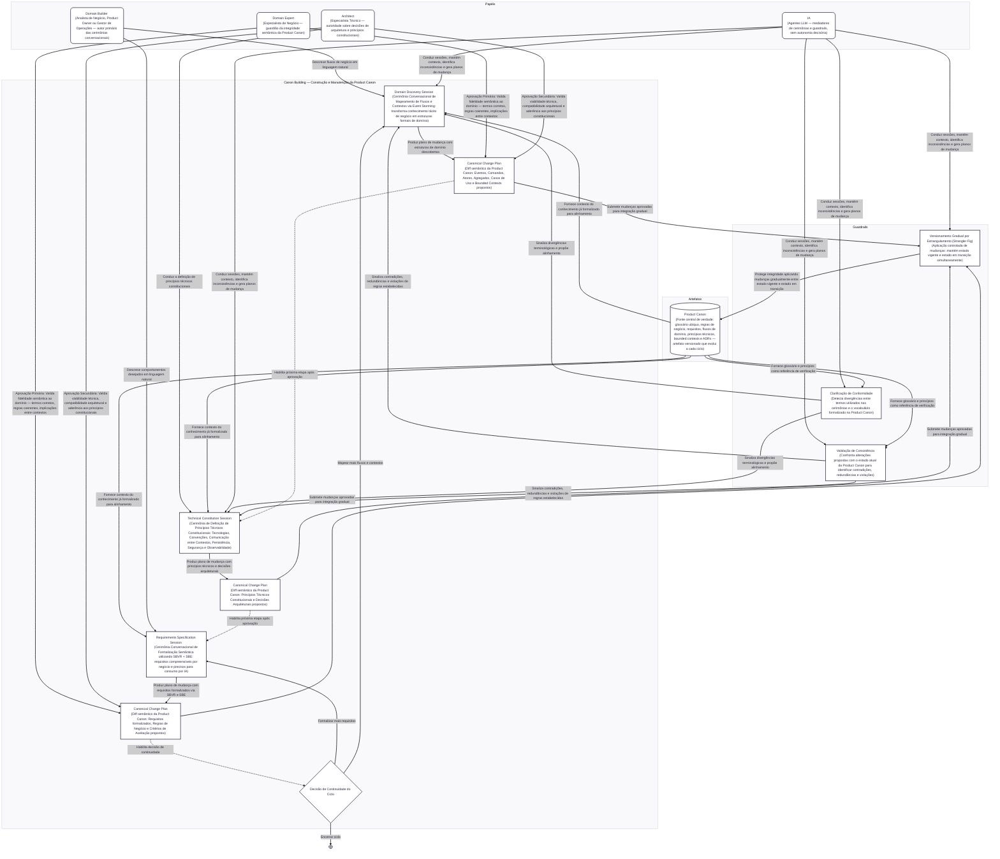

## Conceitos

### Cerimônias

**Domain Discovery Session** — Cerimônia conversacional de mapeamento de fluxos e contextos de negócio, estruturada segundo a dinâmica de Event Storming. O Domain Builder descreve processos de negócio em linguagem natural, e a IA conduz a identificação de eventos de domínio, comandos, atores, agregados, casos de uso e bounded contexts. Seu propósito é transformar conhecimento tácito de negócio em estruturas formais de domínio que alimentam a Product Canon. A sessão consome contexto da Product Canon existente para garantir alinhamento com o conhecimento já formalizado, e seu resultado é um Canonical Change Plan contendo as estruturas descobertas.

**Technical Constitution Session** — Cerimônia conduzida pelo Architect para definir os princípios técnicos que governam o produto: tecnologias, padrões de comunicação entre contextos, estratégias de persistência, políticas de segurança e requisitos de observabilidade. Os princípios constitucionais funcionam como restrições invioláveis — toda especificação futura deve respeitá-los ou justificar formalmente a exceção. A sessão é habilitada após a conclusão de um Canonical Change Plan produzido pela Domain Discovery Session, e seu resultado é um Canonical Change Plan específico da camada de arquitetura.

**Requirements Specification Session** — Cerimônia conversacional de formalização semântica de requisitos, onde o Domain Builder descreve comportamentos desejados em linguagem natural e a IA os estrutura utilizando SBVR (Semantics of Business Vocabulary and Business Rules) para vocabulário e regras de negócio declarativas, e SBE (Specification by Example) para critérios de aceitação verificáveis por meio de exemplos concretos. O objetivo é produzir requisitos que sejam simultaneamente compreensíveis por pessoas de negócio e formalmente precisos o suficiente para consumo por agentes de IA. A sessão consome contexto da Product Canon e é habilitada após a Technical Constitution Session.

### Artefatos

**Product Canon** — Núcleo vivo de conhecimento do produto que funciona como fonte central de verdade sobre o domínio e a arquitetura. Contém o glossário de linguagem ubíqua, regras de negócio declarativas, requisitos formalizados, fluxos de domínio, princípios técnicos constitucionais, bounded contexts, eventos de domínio, context maps e registros de decisões arquiteturais. A Product Canon não é um documento estático — é um artefato versionado que evolui a cada ciclo de Canon Building, fornecendo contexto para todas as cerimônias e sendo atualizado pelos Canonical Change Plans aprovados. Sua integridade é protegida pelos guardrails do processo.

**Canonical Change Plan** — Plano de mudança que declara explicitamente quais alterações uma cerimônia propõe à Product Canon. Funciona como um diff semântico entre o estado atual da Product Canon e o estado proposto, listando eventos, comandos, atores, agregados, casos de uso e bounded contexts novos ou alterados. Cada Canonical Change Plan requer aprovação dual: o Domain Expert valida a fidelidade semântica ao domínio e o Architect valida a viabilidade técnica e sustentabilidade. Somente após aprovação as alterações são aplicadas à Product Canon via versionamento gradual.

### Papéis

**Domain Builder** — Papel exercido por analistas de negócio, product owners ou gestores de operações que conhecem o produto e seus processos. É o autor primário das cerimônias conversacionais: descreve fluxos de negócio na Domain Discovery Session e comportamentos desejados na Requirements Specification Session. Não precisa de vocabulário técnico — seus gaps de precisão terminológica são compensados pelos guardrails semânticos da IA e pela validação do Domain Expert.

**Domain Expert** — Especialista de negócio que detém autoridade sobre o significado dos conceitos do domínio. Não participa diretamente das cerimônias nem escreve especificações. Atua como aprovador primário dos Canonical Change Plans, validando que as mudanças propostas são fiéis à realidade do domínio — termos corretos, regras coerentes, implicações entre contextos consideradas. É o guardião da integridade semântica da Product Canon.

**Architect** — Especialista técnico que detém autoridade sobre decisões de arquitetura e estrutura do sistema. Conduz a Technical Constitution Session, definindo princípios técnicos constitucionais. Atua como aprovador secundário dos Canonical Change Plans, validando viabilidade técnica, compatibilidade com a arquitetura existente e aderência aos princípios constitucionais. Quando uma exceção é necessária, formaliza a justificativa como registro de decisão arquitetural.

**IA** — Agentes baseados em Large Language Models que atuam como mediadores em todas as cerimônias e guardrails do processo. A IA conduz as sessões conversacionais, mantém contexto da Product Canon, identifica inconsistências semânticas e técnicas, propõe clarificações, e gera Canonical Change Plans. Participa da Clarificação de Conformidade, da Validação de Consistência e do Versionamento Gradual por Estrangulamento. No Canon Building, a IA não opera de forma autônoma — suas propostas são sempre submetidas à aprovação dos papéis humanos competentes.

### Guardrails

**Clarificação de Conformidade** — Mecanismo que detecta e sinaliza divergências entre os termos utilizados nas cerimônias e o vocabulário formalizado na Product Canon. Quando um participante utiliza um termo que conflita com o glossário de linguagem ubíqua ou com os princípios técnicos constitucionais, a IA identifica a inconsistência e propõe alinhamento antes que a divergência se propague para o Canonical Change Plan. Atua nas sessões de Domain Discovery e Technical Constitution, consumindo contexto da Product Canon para exercer a verificação.

**Validação de Consistência** — Mecanismo que confronta alterações propostas com o estado atual da Product Canon para identificar contradições, redundâncias e violações de regras já estabelecidas. Verifica tanto a camada de negócio (regras de negócio, requisitos, glossário) quanto a camada de arquitetura (princípios técnicos, schemas de eventos, relações entre contextos). Contradições são sinalizadas antes de serem aceitas em qualquer Canonical Change Plan, garantindo que a Product Canon permaneça internamente coerente ao longo do tempo.

**Versionamento Gradual por Estrangulamento** — Mecanismo de aplicação controlada de mudanças na Product Canon, inspirado no padrão Strangler Fig de migração de sistemas. Mudanças estruturais significativas — como a divisão de um bounded context, a redefinição de um conceito central ou a remoção de um evento de domínio — não são aplicadas atomicamente. A Product Canon mantém duas faces: o estado vigente (current) e o estado aprovado em transição (next). Canonical Change Plans aprovados são integrados gradualmente, protegendo a integridade da Product Canon contra alterações destabilizantes e permitindo que cerimônias em andamento continuem referenciando o estado vigente enquanto a transição se completa.