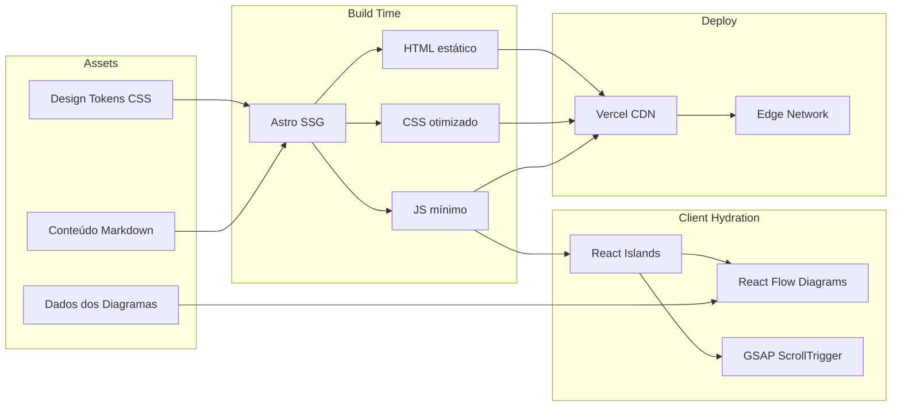
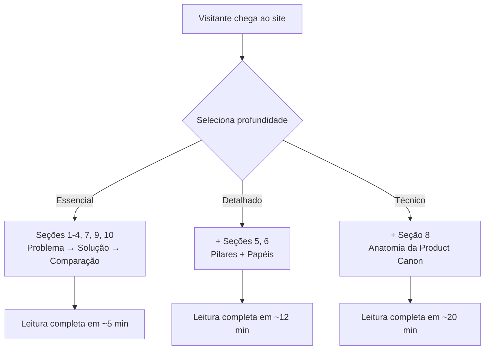
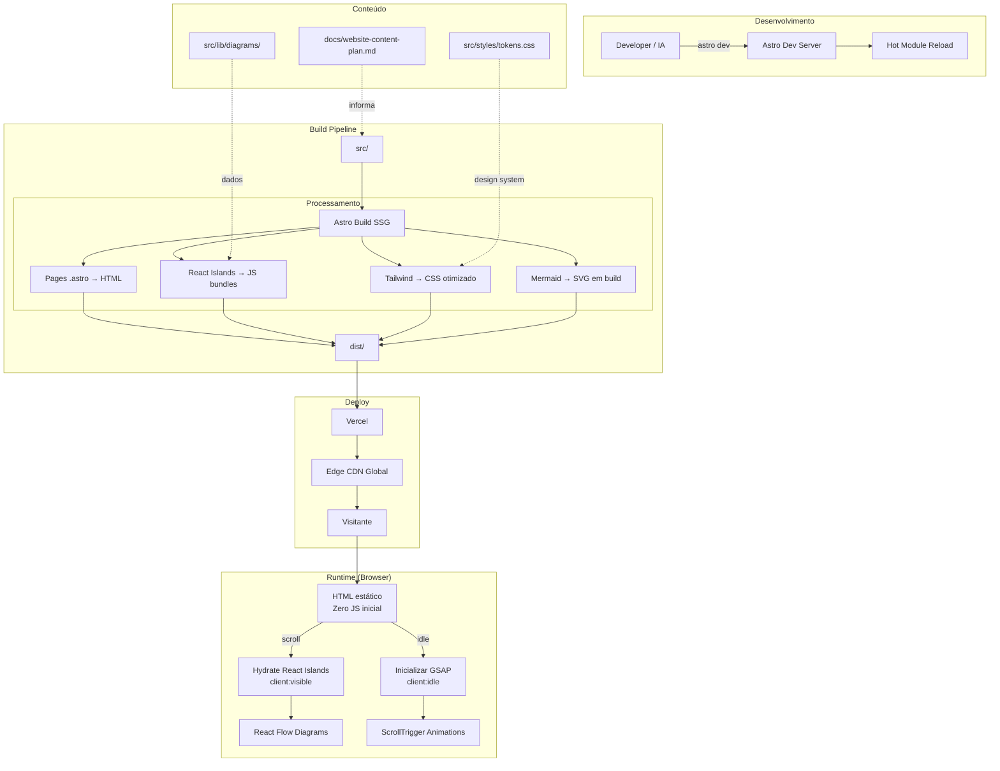

# ZionKit — Plano de Implementação Técnico do Site Institucional

**Versão:** 1.0  
**Data:** Abril 2026  
**Documento de referência:** [`docs/website-content-plan.md`](./website-content-plan.md)  
**Audiência:** Desenvolvedores front-end e IAs de codificação

---

## 1. Resumo Executivo

Este documento define o plano técnico para implementar o site institucional do ZionKit — um site estático de página única (SPA-like) com estética premium inspirada em aurora boreal (Borealis Theme), animações scroll-driven, 8 diagramas interativos e estrutura narrativa progressiva.

O site traduz fielmente o roteiro de conteúdo de `docs/website-content-plan.md` sem alterar estrutura narrativa nem conteúdo. Cada seção do roteiro é mapeada a componentes específicos, com estratégias de animação, diagramas e interatividade definidas.

**Decisões-chave:**
- **Framework:** Astro + React Islands (interatividade seletiva)
- **Estilização:** Tailwind CSS v4 + CSS custom properties (design tokens)
- **Animações:** GSAP + ScrollTrigger (timeline e scroll), CSS animations (micro-interações)
- **Diagramas:** React Flow (interativos) + Mermaid (estáticos renderizados em build)
- **Deploy:** Vercel (SSG)

---

## 2. Stack Tecnológico

### Framework: Astro 5.x

**Justificativa:** Astro é o framework ideal para sites institucionais estáticos com ilhas de interatividade. Envia zero JavaScript por padrão, renderiza em build time, e permite componentes React apenas onde necessário (diagramas interativos, animações complexas). Performance superior a Next.js para este caso de uso.

| Tecnologia | Versão | Papel |
|---|---|---|
| **Astro** | 5.x | Framework principal, SSG, roteamento |
| **React** | 19.x | Islands de interatividade (diagramas, animações) |
| **TypeScript** | 5.x | Tipagem em componentes e utilitários |
| **Tailwind CSS** | 4.x | Utility-first styling + design tokens via CSS vars |
| **GSAP** | 3.x | Animações de timeline, scroll-triggered, aurora |
| **@xyflow/react** | 12.x | Diagramas interativos (React Flow) |
| **mermaid** | 11.x | Diagramas estáticos (renderizados em build) |
| **Fonter**: Inter + JetBrains Mono | — | Tipografia principal e code blocks |
| **Vercel** | — | Deploy, CDN, analytics |

### Estrutura de diretórios

```
src/
├── components/
│   ├── ui/              # Componentes base (Button, Card, Badge, etc.)
│   ├── sections/        # Componentes de seção (1 por seção do roteiro)
│   ├── diagrams/        # Componentes de diagramas (React islands)
│   ├── animations/      # Componentes de animação (Aurora, ScrollReveal)
│   └── layout/          # Header, Footer, Navigation, ProgressBar
├── layouts/
│   └── BaseLayout.astro # Layout base com meta tags e fontes
├── pages/
│   └── index.astro      # Página única com todas as seções
├── styles/
│   ├── tokens.css       # Design tokens (CSS custom properties)
│   ├── base.css         # Reset, tipografia base, utilitários globais
│   └── animations.css   # Keyframes e classes de animação
├── lib/
│   ├── diagrams/        # Dados e configurações dos diagramas
│   └── utils.ts         # Utilitários compartilhados
└── assets/
    ├── icons/           # SVGs de ícones
    └── images/          # Imagens otimizadas (se houver)
```

---

## 3. Arquitetura de Componentes

Mapeamento direto entre seções do roteiro (`docs/website-content-plan.md`) e componentes:

| Seção do Roteiro | Componente | Tipo | Ilha React? |
|---|---|---|---|
| **Seção 1** — O Problema | `sections/HeroSection.astro` | Astro | Não |
| **Seção 2** — A Agitação | `sections/AgitationSection.astro` | Astro | Sim (diagrama) |
| **Seção 3** — A Solução | `sections/SolutionBridgeSection.astro` | Astro | Não |
| **Seção 4** — Visão Geral | `sections/CycleOverviewSection.astro` | Astro | Sim (diagrama) |
| **Seção 5** — Três Pilares | `sections/PillarsSection.astro` | Astro | Sim (diagramas) |
| **Seção 6** — Papéis | `sections/RolesSection.astro` | Astro | Sim (diagrama) |
| **Seção 7** — Antes/Depois | `sections/ComparisonSection.astro` | Astro | Não |
| **Seção 8** — Product Canon | `sections/CanonDeepDiveSection.astro` | Astro | Não |
| **Seção 9** — Cenários | `sections/ScenariosSection.astro` | Astro | Não |
| **Seção 10** — Glossário | `sections/GlossarySection.astro` | Astro | Não |

### Componentes compartilhados

| Componente | Descrição |
|---|---|
| `layout/StickyNav.astro` | Navegação fixa com indicador de seção ativa |
| `layout/ProgressBar.astro` | Barra de progresso de leitura (scroll %) |
| `layout/DepthIndicator.astro` | Indicador de camada de profundidade (Camada 1/2/3) |
| `animations/AuroraBackground.astro` | Background animado com efeito aurora boreal |
| `animations/ScrollReveal.astro` | Wrapper para reveal on scroll (GSAP) |
| `ui/SectionHeader.astro` | Título + subtítulo + badge de camada |
| `ui/ExampleBlock.astro` | Bloco de exemplo prático (quote estilizado) |
| `ui/StatCard.astro` | Card de estatística (dados da Seção 2) |
| `ui/ComparisonRow.astro` | Linha de comparação antes/depois |
| `ui/GlossaryItem.astro` | Item do glossário com expand/collapse |
| `ui/DiagramContainer.astro` | Container padronizado para diagramas |

### Diagrama de arquitetura de componentes

```mermaid
graph TD
    subgraph Layout
        BL[BaseLayout.astro]
        SN[StickyNav]
        PB[ProgressBar]
        DI[DepthIndicator]
        AB[AuroraBackground]
    end

    subgraph Sections
        S1[HeroSection<br/>Seção 1]
        S2[AgitationSection<br/>Seção 2]
        S3[SolutionBridgeSection<br/>Seção 3]
        S4[CycleOverviewSection<br/>Seção 4]
        S5[PillarsSection<br/>Seção 5]
        S6[RolesSection<br/>Seção 6]
        S7[ComparisonSection<br/>Seção 7]
        S8[CanonDeepDiveSection<br/>Seção 8]
        S9[ScenariosSection<br/>Seção 9]
        S10[GlossarySection<br/>Seção 10]
    end

    subgraph "React Islands (client:visible)"
        D1[ContextVoidDiagram<br/>Diagrama 1]
        D2[ThreeGapsDiagram<br/>Diagrama 2]
        D3[CycleDiagram<br/>Diagrama 3]
        D4[CanonBuildingDiagram<br/>Diagrama 4]
        D5[ContextualSpecDiagram<br/>Diagrama 5]
        D6[FeedbackDiagram<br/>Diagrama 6]
        D7[RolesMatrixDiagram<br/>Diagrama 7]
        D8[BeforeAfterDiagram<br/>Diagrama 8]
    end

    subgraph "UI Components"
        SH[SectionHeader]
        EB[ExampleBlock]
        SC[StatCard]
        CR[ComparisonRow]
        GI[GlossaryItem]
    end

    BL --> SN & PB & DI & AB
    BL --> S1 & S2 & S3 & S4 & S5 & S6 & S7 & S8 & S9 & S10
    S1 --> D1
    S2 --> D2 & SC
    S4 --> D3
    S5 --> D4 & D5 & D6
    S6 --> D7
    S7 --> D8 & CR
    S9 --> EB
    S10 --> GI
```



---

## 4. Design System — Borealis Theme

O Borealis Theme é um sistema visual dark premium inspirado em aurora boreal: fundos escuros profundos, acentos em gradientes de verde-ciano-violeta, tipografia limpa e espaçamento generoso.

### 4.1 Design Tokens (CSS Custom Properties)

```css
/* === src/styles/tokens.css === */

:root {
  /* ── Cores Base ── */
  --color-bg-primary: #0a0e17;        /* Fundo principal — quase preto azulado */
  --color-bg-secondary: #111827;      /* Fundo de cards e seções alternadas */
  --color-bg-tertiary: #1a2332;       /* Fundo de blocos de código, quotes */
  --color-bg-elevated: #1e293b;       /* Elementos elevados (tooltips, dropdowns) */

  /* ── Cores de Texto ── */
  --color-text-primary: #f1f5f9;      /* Texto principal — branco suave */
  --color-text-secondary: #94a3b8;    /* Texto secundário — cinza médio */
  --color-text-muted: #64748b;        /* Texto terciário — cinza escuro */
  --color-text-accent: #67e8f9;       /* Texto de destaque — ciano aurora */

  /* ── Cores Aurora (Gradientes) ── */
  --color-aurora-green: #34d399;      /* Verde aurora — emerald */
  --color-aurora-cyan: #22d3ee;       /* Ciano aurora — primário */
  --color-aurora-blue: #60a5fa;       /* Azul aurora */
  --color-aurora-violet: #a78bfa;     /* Violeta aurora */
  --color-aurora-pink: #f472b6;       /* Rosa aurora (uso pontual) */

  /* ── Gradientes ── */
  --gradient-aurora: linear-gradient(135deg, var(--color-aurora-green), var(--color-aurora-cyan), var(--color-aurora-violet));
  --gradient-aurora-soft: linear-gradient(135deg, rgba(52, 211, 153, 0.15), rgba(34, 211, 238, 0.15), rgba(167, 139, 250, 0.15));
  --gradient-text: linear-gradient(135deg, var(--color-aurora-cyan), var(--color-aurora-violet));
  --gradient-glow: radial-gradient(ellipse at 50% 0%, rgba(34, 211, 238, 0.15) 0%, transparent 70%);

  /* ── Cores Semânticas ── */
  --color-problem: #f87171;           /* Vermelho — problemas, "sem ZionKit" */
  --color-solution: #34d399;          /* Verde — soluções, "com ZionKit" */
  --color-warning: #fbbf24;           /* Amarelo — alertas, gates */
  --color-info: #60a5fa;              /* Azul — informação neutra */

  /* ── Bordas ── */
  --color-border-default: rgba(148, 163, 184, 0.1);
  --color-border-hover: rgba(148, 163, 184, 0.2);
  --color-border-accent: rgba(34, 211, 238, 0.3);

  /* ── Tipografia ── */
  --font-sans: 'Inter', system-ui, -apple-system, sans-serif;
  --font-mono: 'JetBrains Mono', 'Fira Code', monospace;

  --text-xs: 0.75rem;     /* 12px */
  --text-sm: 0.875rem;    /* 14px */
  --text-base: 1rem;      /* 16px */
  --text-lg: 1.125rem;    /* 18px */
  --text-xl: 1.25rem;     /* 20px */
  --text-2xl: 1.5rem;     /* 24px */
  --text-3xl: 1.875rem;   /* 30px */
  --text-4xl: 2.25rem;    /* 36px */
  --text-5xl: 3rem;       /* 48px */
  --text-6xl: 3.75rem;    /* 60px — hero title */

  --leading-tight: 1.15;
  --leading-normal: 1.6;
  --leading-relaxed: 1.75;

  --tracking-tight: -0.02em;
  --tracking-normal: 0;
  --tracking-wide: 0.025em;

  /* ── Espaçamento ── */
  --space-1: 0.25rem;     /* 4px */
  --space-2: 0.5rem;      /* 8px */
  --space-3: 0.75rem;     /* 12px */
  --space-4: 1rem;        /* 16px */
  --space-6: 1.5rem;      /* 24px */
  --space-8: 2rem;        /* 32px */
  --space-10: 2.5rem;     /* 40px */
  --space-12: 3rem;       /* 48px */
  --space-16: 4rem;       /* 64px */
  --space-20: 5rem;       /* 80px */
  --space-24: 6rem;       /* 96px */
  --space-32: 8rem;       /* 128px — espaço entre seções */

  /* ── Raios de Borda ── */
  --radius-sm: 0.375rem;  /* 6px */
  --radius-md: 0.5rem;    /* 8px */
  --radius-lg: 0.75rem;   /* 12px */
  --radius-xl: 1rem;      /* 16px */
  --radius-2xl: 1.5rem;   /* 24px */
  --radius-full: 9999px;

  /* ── Sombras ── */
  --shadow-sm: 0 1px 2px rgba(0, 0, 0, 0.3);
  --shadow-md: 0 4px 6px rgba(0, 0, 0, 0.3);
  --shadow-lg: 0 10px 15px rgba(0, 0, 0, 0.4);
  --shadow-glow-cyan: 0 0 20px rgba(34, 211, 238, 0.15);
  --shadow-glow-green: 0 0 20px rgba(52, 211, 153, 0.15);
  --shadow-glow-violet: 0 0 20px rgba(167, 139, 250, 0.15);

  /* ── Transições ── */
  --ease-out-expo: cubic-bezier(0.16, 1, 0.3, 1);
  --ease-in-out-quart: cubic-bezier(0.76, 0, 0.24, 1);
  --duration-fast: 150ms;
  --duration-normal: 300ms;
  --duration-slow: 500ms;
  --duration-very-slow: 800ms;

  /* ── Z-Index ── */
  --z-background: -1;
  --z-default: 0;
  --z-elevated: 10;
  --z-sticky: 50;
  --z-overlay: 100;

  /* ── Breakpoints (para referência — Tailwind gerencia) ── */
  /* sm: 640px, md: 768px, lg: 1024px, xl: 1280px, 2xl: 1536px */

  /* ── Layout ── */
  --max-width-content: 72rem;     /* 1152px — largura máxima de conteúdo */
  --max-width-narrow: 48rem;      /* 768px — textos longos */
  --max-width-diagram: 60rem;     /* 960px — diagramas */
}
```

### 4.2 Componentes Base

**SectionHeader** — Usado em todas as seções. Recebe `title`, `subtitle`, `depth` (1|2|3), `sectionNumber`.

```astro
<!-- Exemplo de uso -->
<SectionHeader
  sectionNumber={1}
  title="O conhecimento do seu produto morre a cada sprint"
  depth={1}
/>
```

Estilos:
- Título: `text-5xl` mobile → `text-6xl` desktop, `font-bold`, `tracking-tight`, `gradient-text` para palavras-chave
- Badge de camada: pill com borda `--color-border-accent`, texto `--color-text-accent`
- Número da seção: `text-sm`, `tracking-wide`, `text-muted`, com linha horizontal à direita

**ExampleBlock** — Blocos de exemplo prático (blockquotes estilizados). Ref: exemplos das Seções 1, 2, 5, 9 de `docs/website-content-plan.md`.

Estilos:
- Fundo: `--color-bg-tertiary`
- Borda esquerda: 3px `--color-aurora-cyan`
- Ícone: aspas ou lâmpada em `--color-aurora-cyan`
- Tipografia: `text-base`, `leading-relaxed`, `italic`

**StatCard** — Cards de estatísticas. Ref: dados de contexto da Seção 2 de `docs/website-content-plan.md`.

Estilos:
- Fundo: `--color-bg-secondary` com `border` sutil
- Número grande: `text-4xl`, `font-bold`, gradiente aurora
- Descrição: `text-sm`, `text-secondary`
- Hover: `shadow-glow-cyan`, borda transiciona para `--color-border-accent`

**ComparisonRow** — Linhas de comparação antes/depois. Ref: Seção 7 de `docs/website-content-plan.md`.

Estilos:
- Duas colunas: esquerda com ícone `✗` em `--color-problem`, direita com `✓` em `--color-solution`
- Separador central: linha vertical com gradiente aurora
- Hover: row inteira destaca sutilmente

**GlossaryItem** — Item expansível do glossário. Ref: Seção 10 de `docs/website-content-plan.md`.

Estilos:
- Termo: `font-mono`, `text-accent`
- Definição: oculta por padrão, expand com animação (height + opacity)
- Analogia: badge "Analogia" + texto em `italic`

### 4.3 Variantes de Seção

As seções alternam entre dois estilos de fundo para criar ritmo visual:

| Seções | Fundo | Efeito |
|---|---|---|
| 1, 3, 5, 7, 9 | `--color-bg-primary` | Aurora glow no topo |
| 2, 4, 6, 8, 10 | `--color-bg-secondary` | Sem glow (contraste) |

---

## 5. Plano de Implementação por Seção

### Seção 1 — O Problema (Hero)
**Ref:** `docs/website-content-plan.md`, Seção 1 — "O Problema (Abertura PAS)"

**Componentes:**
- `HeroSection.astro` — full viewport height, aurora background animado
- `AuroraBackground` — canvas/CSS com gradientes animados no fundo
- **Diagrama 1** — "O Vazio de Contexto" (React Flow island)

**Implementação:**
- Título "O conhecimento do seu produto morre a cada sprint" com palavras-chave em `gradient-text`
- Texto narrativo abaixo, `max-width-narrow` para legibilidade
- Exemplo prático do reembolso em `ExampleBlock`
- Diagrama 1 abaixo do texto, revelado com scroll
- Seta indicativa de scroll no bottom da viewport
- AuroraBackground: gradientes radiais animados com `requestAnimationFrame`, opacidade baixa (0.1-0.2), movimento lento (60s cycle)

**Animações:**
- Título: fade-in + slide-up ao carregar (GSAP, 0.8s, `ease-out-expo`)
- Texto: fade-in sequencial com delay (stagger 0.15s)
- Aurora: loop infinito, CSS `@keyframes` para gradientes
- Diagrama: reveal on scroll (ScrollTrigger)

---

### Seção 2 — A Agitação
**Ref:** `docs/website-content-plan.md`, Seção 2 — "A Agitação (Consequências do Problema)"

**Componentes:**
- `AgitationSection.astro`
- 3x `StatCard` com dados de apoio (35% defeitos, 40% retrabalho, 56% falha comunicação)
- Blocos de texto para os 3 problemas
- `ExampleBlock` para exemplos do PO e notificações
- **Diagrama 2** — "Os Três Gaps" (React Flow island)

**Implementação:**
- Grid de 3 colunas para os problemas (empilha em mobile)
- StatCards em row no topo, com counter animation (números contam de 0 até o valor)
- Diagrama 2 após os 3 blocos de texto
- Cada "gap" é um card independente com ícone e cor `--color-problem`

**Animações:**
- StatCards: counter animation on scroll (GSAP, números incrementam)
- Cards dos 3 problemas: stagger reveal (esquerda → direita)
- Diagrama: fade-in com scale sutil (0.95 → 1)

---

### Seção 3 — A Solução em Uma Frase
**Ref:** `docs/website-content-plan.md`, Seção 3 — "A Solução em Uma Frase (Ponte PAS → Progressive Disclosure)"

**Componentes:**
- `SolutionBridgeSection.astro`
- Texto centralizado em destaque
- `ExampleBlock` para analogia da constituição

**Implementação:**
- Seção curta — "respiro narrativo" conforme roteiro
- Título grande centralizado: "E se todo o conhecimento do seu produto tivesse uma casa?"
- Texto de 2-3 parágrafos, `max-width-narrow`, centralizado
- Destaque visual no termo "Product Canon" (badge com glow)
- Analogia em ExampleBlock estilizado diferenciado (ícone de analogia)

**Animações:**
- Título: fade-in + scale sutil (0.98 → 1)
- "Product Canon": glow pulse em loop (shadow-glow-cyan, 3s cycle)
- Background: gradiente aurora suave que intensifica ao scrollar para esta seção

---

### Seção 4 — Visão Geral do Ciclo
**Ref:** `docs/website-content-plan.md`, Seção 4 — "Como Funciona: Visão Geral (Camada 1)"

**Componentes:**
- `CycleOverviewSection.astro`
- **Diagrama 3** — "O Ciclo ZionKit" (React Flow island — diagrama principal)
- 3 blocos de texto para as 3 etapas
- Badge "Camada 1" no SectionHeader

**Implementação:**
- Diagrama 3 como peça central — ciclo circular interativo com React Flow
- 3 nós principais (Construir, Usar, Devolver) conectados por edges animados
- Nó central: Product Canon (destaque visual com glow)
- Abaixo do diagrama: 3 cards lado a lado descrevendo cada etapa
- Cada card com ícone, título e resumo de 2-3 linhas

**Animações:**
- Diagrama: nós aparecem sequencialmente (1 → 2 → 3 → Canon central)
- Edges: animação de "fluxo" (dash-offset animado em loop)
- Cards: stagger reveal sincronizado com nós do diagrama

---

### Seção 5 — Os Três Pilares em Detalhe
**Ref:** `docs/website-content-plan.md`, Seção 5 — "Os Três Pilares em Detalhe (Camada 2)"

**Componentes:**
- `PillarsSection.astro`
- Sub-componentes para cada pilar (5.1, 5.2, 5.3)
- **Diagrama 4** — "As Três Sessões do Canon Building" (React Flow)
- **Diagrama 5** — "Especificação Contextualizada" (React Flow)
- **Diagrama 6** — "Retroalimentação e Versionamento Gradual" (React Flow)
- Múltiplos `ExampleBlock` (fintech, saúde, cancelamento)
- Badge "Camada 2" no SectionHeader

**Implementação:**
- Seção mais longa — dividida em 3 sub-seções com navegação interna (tabs ou accordion)
- Cada sub-seção: título, texto narrativo, exemplo prático, diagrama
- **Sub-seção 5.1** (Canon Building): Diagrama 4 mostra fluxo sequencial com gates
  - 3 nós de sessão + 3 nós de gate conectados linearmente
  - Gates com cor `--color-warning` (amarelo)
- **Sub-seção 5.2** (Especificação Contextualizada): Diagrama 5 mostra fluxo top-down
  - Product Canon → Especificação → Plano de Mudanças
  - Checklist visual dentro do nó de especificação
- **Sub-seção 5.3** (Retroalimentação): Diagrama 6 em duas partes
  - Parte A: fluxo linear simples (implementação → descobertas → Canon)
  - Parte B: árvore de versionamento (current/next)

**Animações:**
- Transição entre sub-seções: crossfade (300ms)
- Diagramas: reveal on scroll com edges animados
- Gates no Diagrama 4: pulse animation ao entrar em viewport

---

### Seção 6 — Quem Faz O Quê
**Ref:** `docs/website-content-plan.md`, Seção 6 — "Quem Faz O Quê (Os Papéis)"

**Componentes:**
- `RolesSection.astro`
- 4 cards de papéis (Domain Builder, Architect, Domain Expert, IA)
- **Diagrama 7** — "Quem Faz O Quê em Cada Etapa" (tabela interativa)

**Implementação:**
- 4 cards em grid (2x2 desktop, stack mobile) com:
  - Ícone representativo
  - Nome do papel
  - "Quem é" em `text-secondary`
  - "O que faz" em destaque
  - Analogia em `italic`, `text-muted`
- Diagrama 7 como tabela interativa (não React Flow — é uma matriz)
  - Implementar como HTML table estilizada com hover por célula
  - Headers: 3 etapas (colunas) × 4 papéis (linhas)
  - Hover destaca a linha inteira do papel
  - Células com texto curto e ícone de ação

**Animações:**
- Cards: stagger reveal (2x2 grid, diagonal)
- Tabela: fade-in por linha com stagger
- Hover na tabela: highlight com transição (150ms)

---

### Seção 7 — Antes e Depois
**Ref:** `docs/website-content-plan.md`, Seção 7 — "Antes e Depois (Comparação)"

**Componentes:**
- `ComparisonSection.astro`
- 7x `ComparisonRow`
- **Diagrama 8** — "Antes / Depois" (HTML/CSS — não precisa React Flow)

**Implementação:**
- Layout de duas colunas com header "SEM ZionKit" (vermelho) e "COM ZionKit" (verde)
- 7 linhas de comparação conforme roteiro
- Coluna esquerda: ícone `✗`, fundo com tint vermelho sutil
- Coluna direita: ícone `✓`, fundo com tint verde sutil
- Separador central: linha vertical com gradiente aurora
- Mobile: stack vertical, cada item mostra antes→depois

**Animações:**
- Rows: reveal alternado (esquerda/direita) com ScrollTrigger
- Ícones: escala de 0 → 1 com bounce no reveal
- Linha central: draw animation (cresce de cima para baixo conforme scroll)

---

### Seção 8 — Product Canon (Deep Dive)
**Ref:** `docs/website-content-plan.md`, Seção 8 — "O Que É a Product Canon (Camada 3)"

**Componentes:**
- `CanonDeepDiveSection.astro`
- Duas sub-seções: Camada de Negócio + Camada de Arquitetura
- Badge "Camada 3" no SectionHeader

**Implementação:**
- Layout de duas colunas representando as duas camadas:
  - Esquerda: "Camada de Negócio" com borda `--color-aurora-green`
  - Direita: "Camada de Arquitetura" com borda `--color-aurora-violet`
- Cada item da camada: card compacto com nome do artefato + descrição de 1-2 linhas
- Nota de rodapé: "Todos os artefatos são documentos markdown versionados em Git"
- Badge visual indicando "Conteúdo técnico — Camada 3"

**Animações:**
- Colunas: reveal simultâneo com slide-in (esquerda ← / direita →)
- Cards dentro de cada coluna: stagger reveal (150ms)

---

### Seção 9 — Cenários de Aplicação
**Ref:** `docs/website-content-plan.md`, Seção 9 — "Cenários de Aplicação"

**Componentes:**
- `ScenariosSection.astro`
- 3 cenários em tabs ou cards expandíveis
- `ExampleBlock` adaptado para narrativa de cenário

**Implementação:**
- 3 tabs horizontais: "Greenfield", "Brownfield", "Mudança Grande"
- Cada tab: título do cenário, contexto da situação, passos numerados
- Passos com timeline visual (linha vertical + dots numerados)
- Mobile: accordion em vez de tabs

**Animações:**
- Transição entre tabs: crossfade (250ms)
- Timeline: dots aparecem sequencialmente ao abrir a tab (stagger 200ms)

---

### Seção 10 — Glossário
**Ref:** `docs/website-content-plan.md`, Seção 10 — "Glossário Acessível"

**Componentes:**
- `GlossarySection.astro`
- N × `GlossaryItem` (15 termos conforme roteiro)

**Implementação:**
- Lista vertical de termos, inicialmente colapsados (apenas termo visível)
- Click expande: definição + analogia
- Busca/filtro simples no topo (JavaScript vanilla, sem framework)
- Agrupamento alfabético opcional
- Cada item com âncora (hash link) para referência direta de outras seções

**Animações:**
- Expand/collapse: height transition (300ms) + opacity
- Busca: filtragem com fade-out/fade-in dos itens

---

## 6. Estratégia de Diagramas

### Abordagem geral

Os 8 diagramas do roteiro usam duas tecnologias conforme complexidade e interatividade necessária:

| Diagrama | Tecnologia | Justificativa |
|---|---|---|
| **D1** — O Vazio de Contexto | React Flow | Fluxo com "quebra" visual — nós custom com estado visual |
| **D2** — Os Três Gaps | React Flow | 3 nós paralelos com conteúdo rico |
| **D3** — O Ciclo ZionKit | React Flow | Diagrama central — ciclo com edges animados |
| **D4** — As Três Sessões | React Flow | Fluxo sequencial com gates — nós customizados |
| **D5** — Especificação Contextualizada | React Flow | Fluxo top-down com checklist interativo |
| **D6** — Retroalimentação | React Flow (Parte A) + HTML (Parte B) | Parte A é fluxo, Parte B é árvore simples |
| **D7** — Papéis por Etapa | HTML Table | Tabela — React Flow seria overkill |
| **D8** — Antes/Depois | HTML/CSS | Comparação — layout nativo é suficiente |

### Configuração padrão React Flow

Todos os diagramas React Flow compartilham:
- `fitView` habilitado (ajuste automático ao container)
- Zoom: desabilitado em mobile, habilitado em desktop
- Pan: desabilitado (diagramas estáticos posicionados)
- Background: `--color-bg-secondary` com dots pattern sutil
- Edges: estilo `smoothstep`, cor `--color-aurora-cyan` com opacidade 0.5
- Animação de edge: dash-offset animado via CSS (`stroke-dasharray` + `@keyframes`)

### Nós customizados

Cada diagrama define nós customizados via `nodeTypes`:

**NodeCard** — nó padrão com título, conteúdo e borda colorida:
```tsx
// Estrutura conceitual do nó
interface NodeCardData {
  title: string;
  content: string | string[];
  variant: 'default' | 'problem' | 'solution' | 'gate' | 'canon';
  icon?: string;
}
```

Variantes visuais:
- `default`: borda `--color-border-default`, fundo `--color-bg-secondary`
- `problem`: borda `--color-problem`, ícone vermelho
- `solution`: borda `--color-solution`, ícone verde
- `gate`: borda `--color-warning`, ícone de checkpoint
- `canon`: borda `--color-aurora-cyan`, glow, fundo com gradiente sutil

### Exemplo: Diagrama 3 — "O Ciclo ZionKit"

```tsx
// lib/diagrams/cycle-diagram.ts — dados do Diagrama 3
// Ref: docs/website-content-plan.md, Seção 4, "Diagrama 3"

const nodes = [
  {
    id: 'canon',
    type: 'nodeCard',
    position: { x: 250, y: 0 },
    data: {
      title: 'Product Canon',
      content: 'Repositório vivo de conhecimento',
      variant: 'canon',
    },
  },
  {
    id: 'build',
    type: 'nodeCard',
    position: { x: 0, y: 200 },
    data: {
      title: 'Etapa 1 — Construir',
      content: '3 sessões formais com aprovação',
      variant: 'default',
    },
  },
  {
    id: 'use',
    type: 'nodeCard',
    position: { x: 250, y: 350 },
    data: {
      title: 'Etapa 2 — Usar para Especificar',
      content: 'Contexto injetado automaticamente',
      variant: 'default',
    },
  },
  {
    id: 'feedback',
    type: 'nodeCard',
    position: { x: 500, y: 200 },
    data: {
      title: 'Etapa 3 — Devolver o Aprendizado',
      content: 'Retroalimentação formal',
      variant: 'default',
    },
  },
];

const edges = [
  { id: 'canon-build', source: 'canon', target: 'build', label: 'contexto injetado', animated: true },
  { id: 'build-use', source: 'build', target: 'use' },
  { id: 'use-feedback', source: 'use', target: 'feedback' },
  { id: 'feedback-canon', source: 'feedback', target: 'canon', label: 'descobertas', animated: true },
];
```

### Exemplo Mermaid — Arquitetura do Projeto (renderizado em build)



---

## 7. Animações e Interatividade

### 7.1 Aurora Boreal (Background)

**Técnica:** CSS radial-gradients com animação de posição e opacidade via `@keyframes`.

```css
/* Conceitual — src/styles/animations.css */
.aurora-bg {
  position: fixed;
  inset: 0;
  z-index: var(--z-background);
  overflow: hidden;
  pointer-events: none;
}

.aurora-bg::before,
.aurora-bg::after {
  content: '';
  position: absolute;
  width: 150%;
  height: 50%;
  border-radius: 50%;
  filter: blur(80px);
  opacity: 0.12;
  animation: aurora-drift 60s ease-in-out infinite alternate;
}

.aurora-bg::before {
  background: radial-gradient(ellipse, var(--color-aurora-green), transparent 70%);
  top: -20%;
  left: -25%;
}

.aurora-bg::after {
  background: radial-gradient(ellipse, var(--color-aurora-violet), transparent 70%);
  top: -10%;
  right: -25%;
  animation-delay: -30s;
  animation-duration: 45s;
}

@keyframes aurora-drift {
  0%   { transform: translate(0, 0) rotate(0deg); opacity: 0.08; }
  33%  { transform: translate(5%, 3%) rotate(2deg); opacity: 0.15; }
  66%  { transform: translate(-3%, -2%) rotate(-1deg); opacity: 0.10; }
  100% { transform: translate(2%, 1%) rotate(1deg); opacity: 0.12; }
}
```

**Comportamento:**
- Sempre visível, opacidade baixa (0.08-0.15)
- Intensifica levemente na Seção 3 (solução) e Seção 4 (ciclo) via ScrollTrigger
- Em mobile: simplificado para 1 gradiente apenas (performance)
- `prefers-reduced-motion`: aurora estática (sem animação)

### 7.2 Scroll-Triggered Animations (GSAP + ScrollTrigger)

**Padrão de uso:** componente wrapper `ScrollReveal` que aplica animação GSAP ao entrar no viewport.

```astro
<!-- Uso em seções -->
<ScrollReveal animation="fade-up" delay={0.2}>
  <p>Conteúdo revelado ao scrollar</p>
</ScrollReveal>
```

**Animações disponíveis:**

| Nome | Efeito | Duração | Uso |
|---|---|---|---|
| `fade-up` | opacity 0→1, translateY 30px→0 | 0.6s | Textos, cards |
| `fade-in` | opacity 0→1 | 0.4s | Imagens, diagramas |
| `slide-left` | opacity 0→1, translateX -40px→0 | 0.6s | Colunas esquerdas |
| `slide-right` | opacity 0→1, translateX 40px→0 | 0.6s | Colunas direitas |
| `scale-in` | opacity 0→1, scale 0.95→1 | 0.5s | Diagramas, cards destaque |
| `stagger` | fade-up com delay incremental | 0.6s + 0.15s/item | Listas, grids |
| `counter` | Número conta de 0 a N | 1.2s | StatCards |
| `draw-line` | strokeDashoffset animado | 0.8s | Separadores, linhas |

**Configuração ScrollTrigger:**
- `trigger`: elemento alvo
- `start`: `"top 80%"` (inicia quando 80% do viewport é alcançado)
- `toggleActions`: `"play none none none"` (executa uma vez)
- `once: true` em todos os triggers (não re-executa ao scrollar para cima)

### 7.3 Micro-interações

| Elemento | Interação | Implementação |
|---|---|---|
| Links e botões | Hover glow | CSS `box-shadow` transition (150ms) |
| Cards | Hover lift | CSS `transform: translateY(-2px)` + `shadow-md` |
| GlossaryItem | Expand/collapse | CSS `max-height` transition + JS toggle |
| Tabs (Seção 5, 9) | Switch content | CSS crossfade + JS state |
| Navbar | Active section | IntersectionObserver + classe ativa |
| Progress bar | Scroll % | Scroll event → width % |
| "Product Canon" badge | Glow pulse | CSS `@keyframes` (box-shadow pulse, 3s loop) |
| Diagrama edges | Flow animation | CSS `stroke-dashoffset` animation |
| StatCard números | Count up | GSAP `from: { textContent: 0 }` |
| Comparison ícones | Bounce in | CSS `@keyframes` bounce |

### 7.4 Acessibilidade de Animações

```css
@media (prefers-reduced-motion: reduce) {
  *,
  *::before,
  *::after {
    animation-duration: 0.01ms !important;
    animation-iteration-count: 1 !important;
    transition-duration: 0.01ms !important;
    scroll-behavior: auto !important;
  }

  .aurora-bg::before,
  .aurora-bg::after {
    animation: none;
    opacity: 0.08;
  }
}
```

Verificar `prefers-reduced-motion` também em JavaScript antes de inicializar GSAP:

```ts
const prefersReducedMotion = window.matchMedia('(prefers-reduced-motion: reduce)').matches;
if (!prefersReducedMotion) {
  // Inicializar GSAP ScrollTrigger
}
```

---

## 8. Performance, Acessibilidade e SEO

### 8.1 Performance (Core Web Vitals)

**Metas:** LCP < 2.5s | CLS < 0.1 | INP < 200ms

| Estratégia | Implementação |
|---|---|
| **Zero JS por padrão** | Astro envia zero JS para seções sem interatividade |
| **Hydration seletiva** | React islands com `client:visible` (hydra ao entrar no viewport) |
| **CSS crítico inline** | Astro faz inline automático de CSS crítico |
| **Fontes otimizadas** | `font-display: swap`, preload de Inter (weight 400, 600, 700) |
| **Lazy load diagramas** | React Flow carregado apenas quando visível (`client:visible`) |
| **GSAP code-split** | Importar GSAP e ScrollTrigger via dynamic import após first paint |
| **content-visibility** | `content-visibility: auto` em seções abaixo do fold |
| **Animações GPU-only** | Usar apenas `transform` e `opacity` (evitar layout triggers) |
| **Imagens** | Se houver: formato WebP/AVIF, `loading="lazy"`, `fetchpriority="high"` no hero |
| **Bundle** | Astro tree-shake por padrão; React Flow importado parcialmente |

**Astro `client:` directives usadas:**
- `client:visible` — diagramas React Flow (carrega quando o container entra no viewport)
- `client:load` — nenhum (nada precisa carregar imediatamente)
- `client:idle` — GSAP initialization script (após o browser ficar idle)

### 8.2 Acessibilidade (WCAG 2.1 AA)

| Critério | Implementação |
|---|---|
| **Contraste** | Todos os pares de cor testados contra 4.5:1 (texto) e 3:1 (UI) |
| **Estrutura semântica** | `<section>`, `<article>`, `<nav>`, headings hierárquicos (h1→h2→h3) |
| **Landmarks** | `role="banner"`, `role="main"`, `role="navigation"`, `role="contentinfo"` |
| **Skip link** | "Pular para o conteúdo" visível no focus, primeiro elemento do DOM |
| **Navegação por teclado** | Tabs, glossário items, e todos os interativos acessíveis via Tab/Enter/Escape |
| **Diagramas** | `aria-label` descritivo em cada container + texto alternativo oculto (`sr-only`) |
| **Animações** | `prefers-reduced-motion` respeitado em CSS e JS |
| **Língua** | `<html lang="pt-BR">` |
| **Focus visible** | `:focus-visible` com outline `--color-aurora-cyan` em todos os interativos |

### 8.3 SEO e Meta Tags

```html
<!-- BaseLayout.astro — meta tags -->
<html lang="pt-BR">
<head>
  <meta charset="UTF-8" />
  <meta name="viewport" content="width=device-width, initial-scale=1.0" />

  <title>ZionKit — O conhecimento do seu produto, formalizado e versionado</title>
  <meta name="description" content="ZionKit é um modelo que cria um repositório central (Product Canon) onde todo o conhecimento do seu produto fica formalizado, versionado e acessível para IAs e equipes." />

  <!-- Open Graph -->
  <meta property="og:title" content="ZionKit — Product Canon para desenvolvimento assistido por IA" />
  <meta property="og:description" content="Formalize, versione e reaproveite o conhecimento do seu produto. A IA trabalha com contexto. O time aprende e não esquece." />
  <meta property="og:type" content="website" />
  <meta property="og:image" content="/og-image.png" />
  <meta property="og:locale" content="pt_BR" />

  <!-- Twitter Card -->
  <meta name="twitter:card" content="summary_large_image" />
  <meta name="twitter:title" content="ZionKit — Product Canon" />
  <meta name="twitter:description" content="O conhecimento do seu produto morre a cada sprint. O ZionKit resolve isso." />

  <!-- Structured Data (JSON-LD) -->
  <script type="application/ld+json">
  {
    "@context": "https://schema.org",
    "@type": "SoftwareApplication",
    "name": "ZionKit",
    "applicationCategory": "DeveloperApplication",
    "description": "Modelo para formalização e versionamento de conhecimento de produto para desenvolvimento assistido por IA",
    "operatingSystem": "Any"
  }
  </script>

  <!-- Fonts -->
  <link rel="preconnect" href="https://fonts.googleapis.com" />
  <link rel="preconnect" href="https://fonts.gstatic.com" crossorigin />
  <link rel="preload" as="style" href="https://fonts.googleapis.com/css2?family=Inter:wght@400;500;600;700&family=JetBrains+Mono:wght@400;500&display=swap" />

  <!-- Canonical -->
  <link rel="canonical" href="https://zionkit.dev/" />
</head>
```

**Sitemap:** Astro gera automaticamente via `@astrojs/sitemap`.

---

## 9. Oportunidades de Melhoria

Além do que está no roteiro, as seguintes melhorias concretas são recomendadas:

### 9.1 Navegação por Camadas de Profundidade

**O que:** Um sistema de filtro visual que permite ao leitor escolher sua "camada de profundidade" — equivalente aos 3 níveis do Progressive Disclosure definidos no roteiro.

**Como:** Toggle persistente no header com 3 opções:
- **Essencial** (Camada 1): mostra Seções 1-4, 7 — para gestores e visitantes casuais
- **Detalhado** (Camada 2): adiciona Seções 5, 6 — para quem quer entender melhor
- **Técnico** (Camada 3): mostra tudo — para arquitetos e engenheiros

Seções ocultas são colapsadas com indicador "Expandir para mais detalhes", não removidas do DOM (SEO e acessibilidade).

**Ref:** `docs/website-content-plan.md`, "Notas de Implementação para o Redator/Designer", item 2 — camadas de profundidade.



### 9.2 Diagramas com Tooltips Contextuais

**O que:** Nos diagramas React Flow, ao passar o mouse sobre um nó, exibir um tooltip com contexto adicional extraído diretamente do roteiro — exemplos práticos, analogias ou dados.

**Como:** Custom nodes com `onMouseEnter` que exibe tooltip posicionado. Exemplo: no Diagrama 3 (Ciclo ZionKit), hover sobre "Etapa 1 — Construir" mostra: "3 sessões guiadas por IA: Descoberta, Constituição Técnica e Especificação".

**Impacto:** Reduz a carga cognitiva — o leitor extrai profundidade sem sair do diagrama.

### 9.3 Indicador de Tempo de Leitura por Seção

**O que:** Badge discreto no SectionHeader mostrando tempo estimado de leitura da seção ("~2 min"), calculado em build time com base no word count.

**Como:** Astro component que conta palavras do slot content e calcula `Math.ceil(wordCount / 200)`. Exibido ao lado do badge de camada.

**Impacto:** Ajuda o leitor a decidir se quer investir tempo na seção, alinhado ao Progressive Disclosure.

### 9.4 Animação de "Enriquecimento" na Product Canon

**O que:** Uma micro-animação recorrente que reforça visualmente o conceito central do ZionKit — que a Product Canon cresce a cada ciclo. Sempre que o usuário scrollar por uma seção que descreve retroalimentação (Seções 4, 5.3), o ícone da Product Canon no canto da tela pulsa e "ganha" um indicador (+1).

**Como:** Ícone fixo discreto no canto inferior direito (como um favicon animado) que reage a ScrollTrigger em pontos específicos. Counter visual de 0 a N que incrementa conforme o usuário avança.

**Impacto:** Reforça visceralmente a narrativa de acumulação de conhecimento.

### 9.5 CTA Estratégico (Conversão)

**O que:** O roteiro não define CTAs (calls-to-action), mas o site institucional deve converter visitantes em leads ou comunidade.

**Como:**
- CTA flutuante após Seção 4: "Quer saber como implementar?" → link para GitHub/documentação
- CTA ao final da Seção 9 (cenários): "Experimente com seu produto" → formulário de early access ou link para setup guide
- Newsletter sutil no footer: campo de email para updates

**Impacto:** Sem CTAs, o site é apenas informativo. CTAs transformam interesse em ação.

---

## 10. Diagrama de Arquitetura do Projeto



---

## 11. Checklist de Implementação

Ordem sugerida de execução. Cada item é uma unidade de trabalho implementável independentemente após suas dependências.

### Fase 1 — Fundação
- [ ] **1.1** Inicializar projeto Astro (`npm create astro@latest`) com TypeScript
- [ ] **1.2** Configurar Tailwind CSS v4 (`@astrojs/tailwind`)
- [ ] **1.3** Criar `src/styles/tokens.css` com design tokens do Borealis Theme
- [ ] **1.4** Criar `src/styles/base.css` com reset, tipografia base, utilitários
- [ ] **1.5** Criar `BaseLayout.astro` com meta tags, fontes, SEO
- [ ] **1.6** Instalar e configurar React integration (`@astrojs/react`)
- [ ] **1.7** Criar `AuroraBackground` (CSS puro)
- [ ] **1.8** Criar componente `StickyNav` com links para as 10 seções
- [ ] **1.9** Criar componente `ProgressBar` (barra de scroll %)

### Fase 2 — Componentes Base
- [ ] **2.1** Criar `SectionHeader` com variantes de camada (1/2/3)
- [ ] **2.2** Criar `ExampleBlock`
- [ ] **2.3** Criar `StatCard`
- [ ] **2.4** Criar `ComparisonRow`
- [ ] **2.5** Criar `GlossaryItem` (expand/collapse)
- [ ] **2.6** Criar `ScrollReveal` wrapper (GSAP ScrollTrigger)
- [ ] **2.7** Criar `DiagramContainer` (wrapper padrão para diagramas)

### Fase 3 — Seções Estáticas (sem diagramas interativos)
- [ ] **3.1** Implementar Seção 1 — HeroSection (texto + aurora) — Ref: roteiro Seção 1
- [ ] **3.2** Implementar Seção 3 — SolutionBridgeSection — Ref: roteiro Seção 3
- [ ] **3.3** Implementar Seção 7 — ComparisonSection (antes/depois) — Ref: roteiro Seção 7
- [ ] **3.4** Implementar Seção 8 — CanonDeepDiveSection (duas camadas) — Ref: roteiro Seção 8
- [ ] **3.5** Implementar Seção 10 — GlossarySection — Ref: roteiro Seção 10

### Fase 4 — Diagramas React Flow
- [ ] **4.1** Instalar `@xyflow/react` e criar componente base `NodeCard`
- [ ] **4.2** Implementar Diagrama 1 — "O Vazio de Contexto" — Ref: roteiro Seção 1
- [ ] **4.3** Implementar Diagrama 2 — "Os Três Gaps" — Ref: roteiro Seção 2
- [ ] **4.4** Implementar Diagrama 3 — "O Ciclo ZionKit" — Ref: roteiro Seção 4
- [ ] **4.5** Implementar Diagrama 4 — "As Três Sessões" — Ref: roteiro Seção 5.1
- [ ] **4.6** Implementar Diagrama 5 — "Especificação Contextualizada" — Ref: roteiro Seção 5.2
- [ ] **4.7** Implementar Diagrama 6 — "Retroalimentação" — Ref: roteiro Seção 5.3
- [ ] **4.8** Implementar Diagrama 7 — "Papéis por Etapa" (tabela HTML) — Ref: roteiro Seção 6
- [ ] **4.9** Implementar Diagrama 8 — "Antes/Depois" (HTML/CSS) — Ref: roteiro Seção 7

### Fase 5 — Seções com Diagramas
- [ ] **5.1** Implementar Seção 2 — AgitationSection (integrar D2 + StatCards) — Ref: roteiro Seção 2
- [ ] **5.2** Implementar Seção 4 — CycleOverviewSection (integrar D3) — Ref: roteiro Seção 4
- [ ] **5.3** Implementar Seção 5 — PillarsSection (integrar D4, D5, D6 + tabs) — Ref: roteiro Seção 5
- [ ] **5.4** Implementar Seção 6 — RolesSection (integrar D7) — Ref: roteiro Seção 6
- [ ] **5.5** Implementar Seção 9 — ScenariosSection (tabs + timeline) — Ref: roteiro Seção 9

### Fase 6 — Animações e Polish
- [ ] **6.1** Implementar ScrollReveal em todas as seções
- [ ] **6.2** Implementar counter animation nos StatCards
- [ ] **6.3** Implementar edge animations nos diagramas React Flow
- [ ] **6.4** Implementar aurora intensificação por seção (ScrollTrigger)
- [ ] **6.5** Implementar `DepthIndicator` (indicador de camada no nav)
- [ ] **6.6** Implementar `prefers-reduced-motion` em CSS e JS

### Fase 7 — Melhorias e Otimização
- [ ] **7.1** Implementar navegação por camadas de profundidade (melhoria 9.1)
- [ ] **7.2** Implementar tooltips nos diagramas (melhoria 9.2)
- [ ] **7.3** Implementar tempo de leitura por seção (melhoria 9.3)
- [ ] **7.4** Implementar CTA estratégico (melhoria 9.5)
- [ ] **7.5** Testar acessibilidade (axe-core, lighthouse)
- [ ] **7.6** Otimizar Core Web Vitals (lighthouse audit)
- [ ] **7.7** Responsividade — testar em 320px, 768px, 1024px, 1440px
- [ ] **7.8** Configurar Vercel deploy + domínio
- [ ] **7.9** Gerar OG image (1200×630) para compartilhamento social

---

*Documento gerado como plano de implementação técnico para o site institucional do ZionKit. Versão 1.0 — Abril 2026.*
